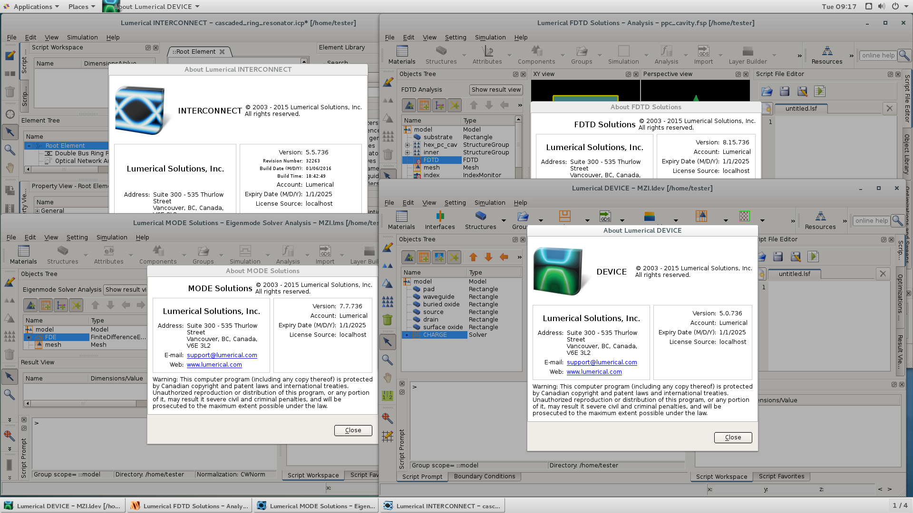
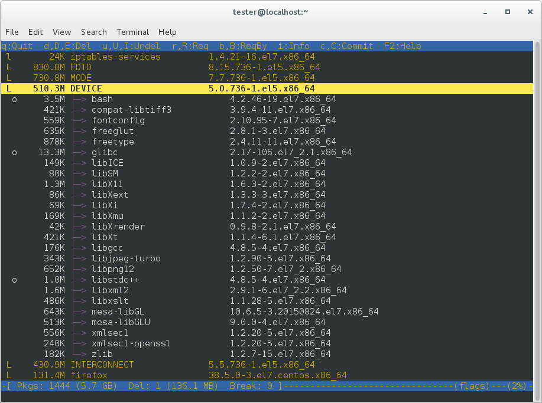
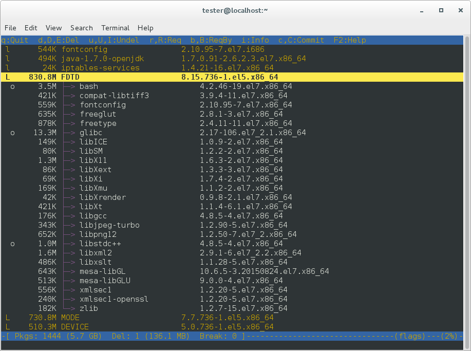
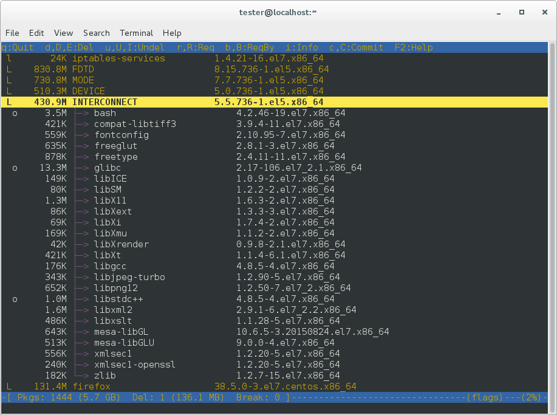
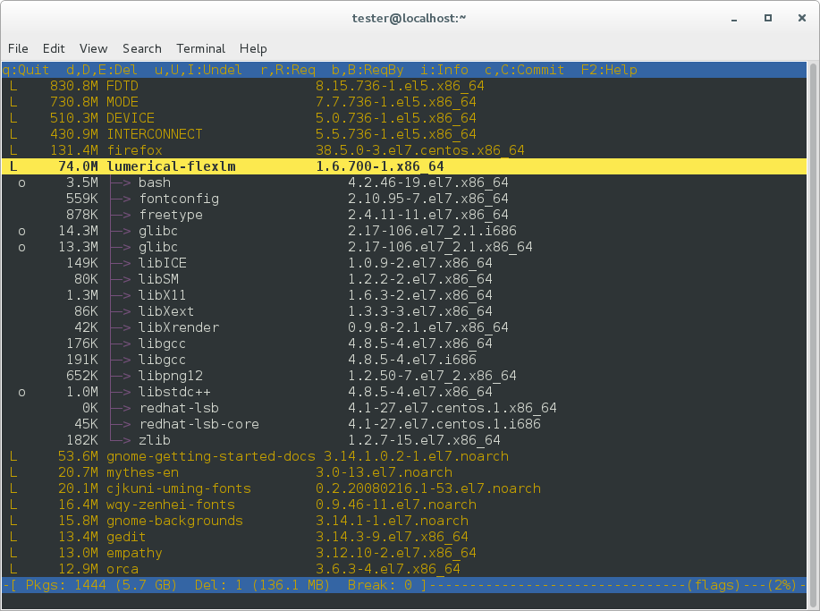

# FDTD Cluster Usage

* 安装的版本为：Lumerical FDTD 2016a Build 736 Linux64
*Tested on CentOS7 - Linux 3.10.0-1160.92.1.el7.x86_64*

## 1. 安装

* Step 0: uninstall old versions DEVICE, FDTD, INTERCONNECT MODE and Lumerical_FlexLM

* Step 1: unpack and install the programs DEVICE, FDTD, INTERCONNECT
        MODE and Lumerical_FlexLM

* Step 2: Stop service "Lumerical FlexNet License Manager":
        run command from terminal console as root:
        # /etc/init.d/lumladmin stop

* Step 3: Extract all files from archive
        "lumerical.2016a.build.736.linux.x64.patch.tar.gz"
        under programs directory and overwrite.
        Default programs directory is /opt/lumerical

* Step 4: Start service "Lumerical FlexNet License Manager",
        run command from terminal console as root:
        # /etc/init.d/lumladmin start

* Example complete instalation procedure, see file

"lumerical_install_(screen_of_terminal).pdf"

```bash
Tested on CentOS7 - Linux 3.10.0-327.3.1.el7.x86_64
running on:
VMware Workstation 12.0.0 build-2985596
```












```bash

```
