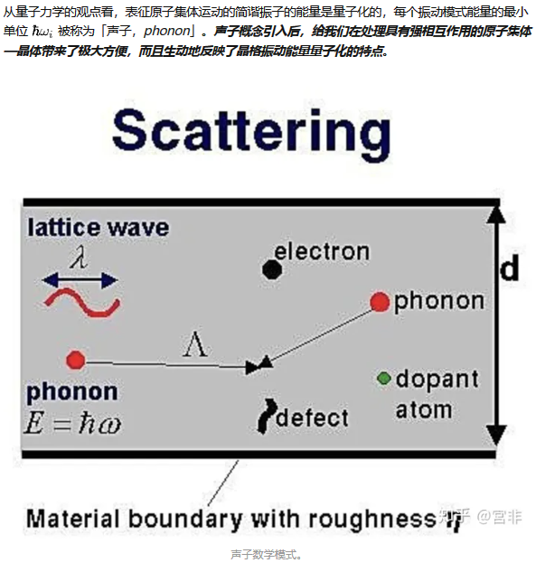
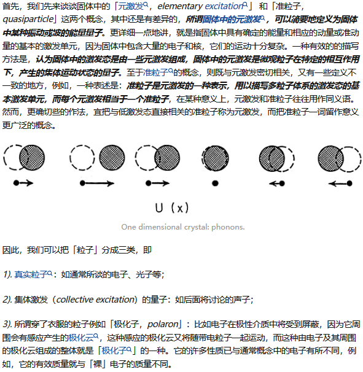
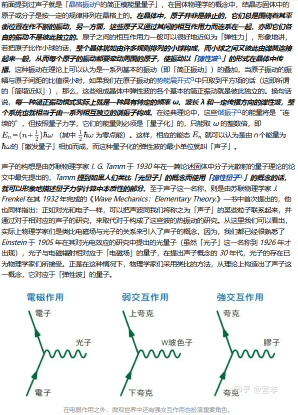
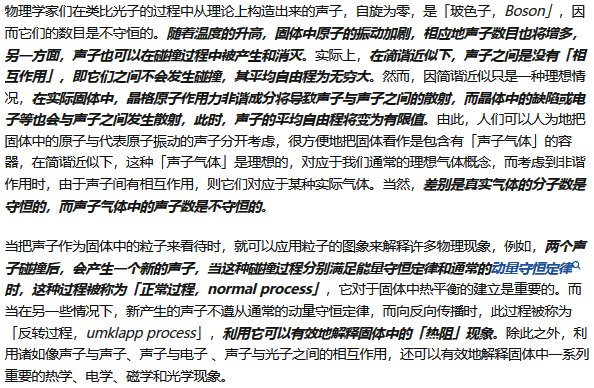

## Phonon 的计算--基于CP2K

- 声子的原理是基于固体中原子的振动。当固体中的原子振动时，它们会产生声波，这些声波可以通过声子来传递。声子的能量和频率与原子的振动有关，因此声子的能量和频率也会随着温度和固体结构的变化而变化。声子的存在可以解释固体中的热传导和热容现象，因为声子是固体中传递热能的主要方式之一。在材料科学和工程学中，声子的研究可以帮助我们了解材料的热性质和机械性质，从而设计更好的材料和器件。

- 声子(Phonon)就是周期性晶格震动量子化的最小单位.

<video src="../../../../media/phonon/phonon.mp4" controls title="晶格中原子振动"></video>

