# Gaussian计算案例

## **结构优化**

### GaussView6.0：

* 输入文件格式：nprocshared--核；mem--内存；%chk--检查点文件；#p--计算类型；opt--优化；

* 输入文件编辑完成后，用Gaussian16打开进行计算。

* Gaussian16计算完成后，通过Utilities--FormChk，将.chk文件转换为.fch文件格式

* .chk文件格式无法通过记事本形式打开，会出现乱码；.fch文件格式可以通过记事本形式打开##

### Gaussian16：

* 打开.chk，最好是.fch文件，即可观察到优化后的分子模型。

* .chk是过程文件；.out是最终输出文件

* .out文件：

* 通过文本编辑器将.out输出文件打开，里面包含所需的各种数据信息。

* cycle为循环次数，error收敛至D^-8^数量级时将停止计算，返回进行各项条件验证。

对力和位移所需要的条件进行对比，条件符合，循环停止，计算停止，输出最后计算结果；条件不符合，重启循环，循环次数+1，循环完成后再次进行对比。

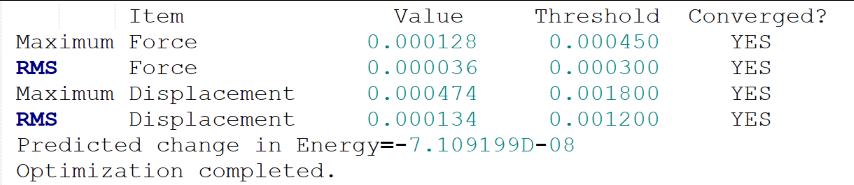

当所需条件全部满足后，循环停止，计算停止，出现Optimization completed，代表优化过程结束，之后输出数据即为优化后所得各项数据。

距离矩阵：

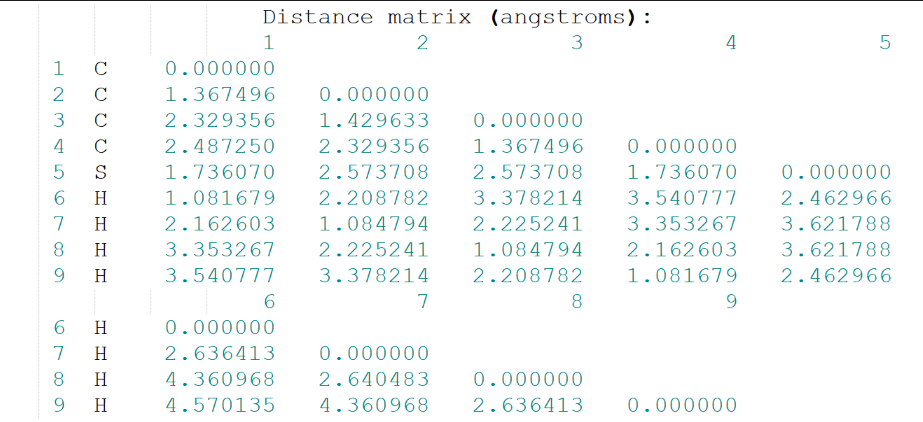

轨道对称性：

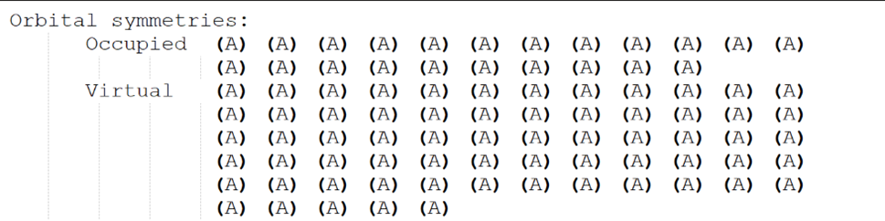

Mulliken电荷：
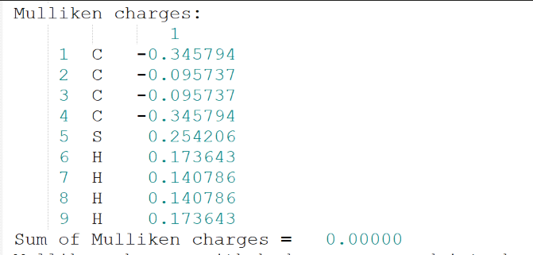
偶极矩&多极矩：
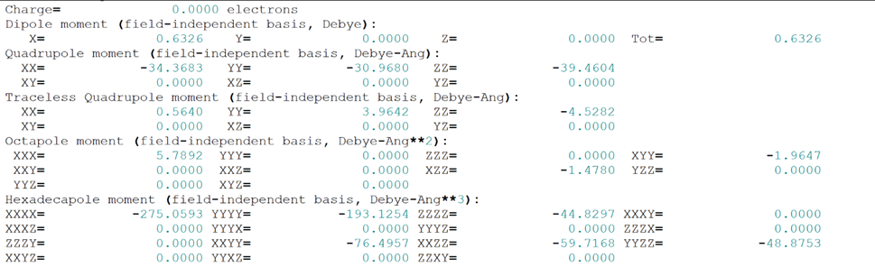
Hartree-Fock能量：
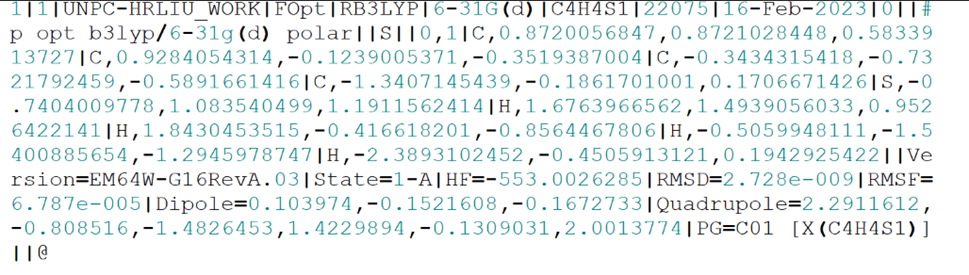
此项代表计算过程无误正式结束：
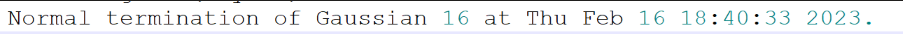
* 原子单位(a.u,)*27.2114 = 电子伏(eV)##

* *gap = |HOMO - LUMO| 能隙分子从基态到激发态所需的最小能量，代表着分子被激发的难易程度##

## **振动光谱（** **IR&Raman** **）**

### GaussView6.0：

* 同理，在优化后的.out文件上进行计算文件编辑，得到raram.gjf文件。

* 输入文件设置如下：

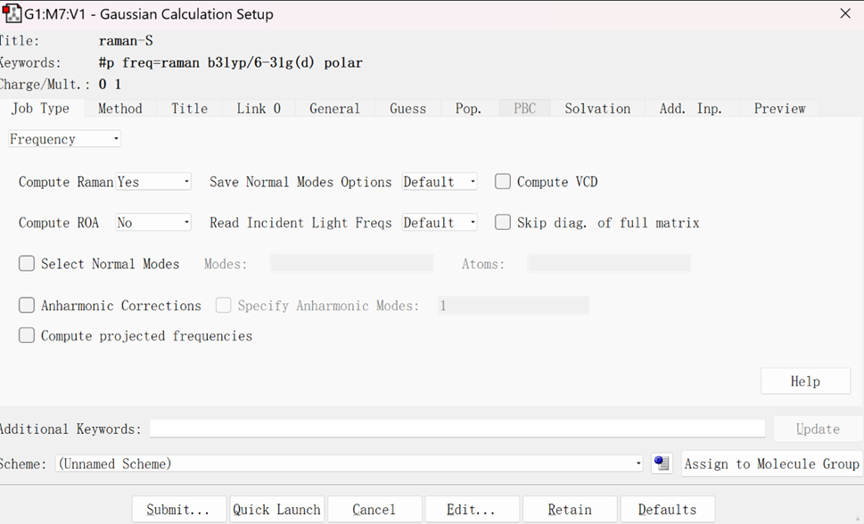

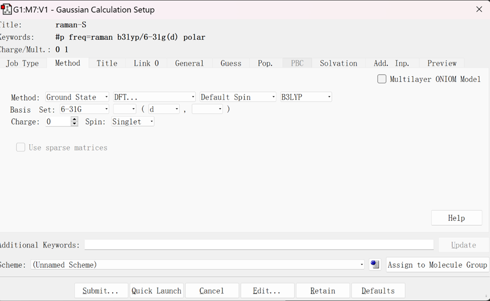

* 选择Frequency选项进行计算

* 输入文件编辑完成后，用Gaussian16打开进行计算。

* Gaussian16计算完成后，通过Utilities--FormChk，将.chk文件转换为.fch文件格式。

* .chk文件格式无法通过记事本形式打开，会出现乱码；.fch文件格式可以通过记事本形式打开

### Gaussian16：

* 打开.out文件，在Results选项中选择Vibartions选项，再选择Spectrum选项，即可得到该分子体系的红外光谱和拉曼活性光谱，如下所示：

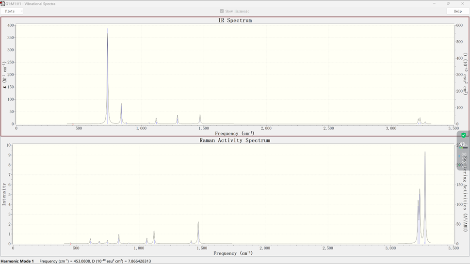

* 通过光谱寻找感兴趣的模式，在Vibartions选项中可以观察分子振动等各项情况，如下图所示：

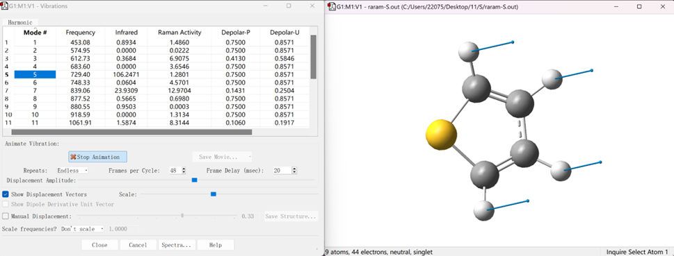

* 点击鼠标右键，选择Save Data，即可将分子光谱数据保存为文本格式，后续可采用Origin软件进行绘图编辑，保存数据格式如下：

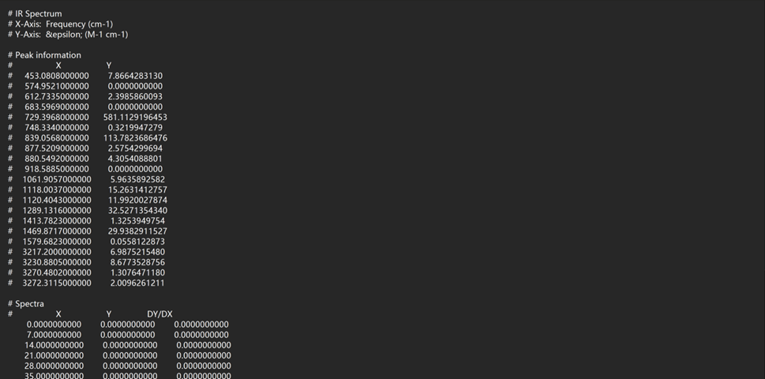

* 注意：

* ==我们要对频率一项进行检查，确保没有虚频模式的存在，即频率数值为负数。==

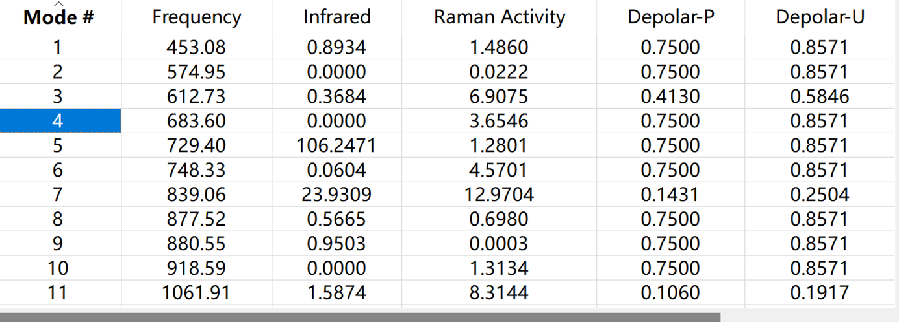

* 若有虚频模式存在，需重新调整一下分子的几何结构模型，从头开始优化，重复上述过程，直至虚频模式消失。

## **紫外—可见光光谱（** **UV-Vis** **）**

* 进行光谱计算前，要先完成基态能量优化步骤，在所生成的.out文件基础之上进行计算的设计，保存为td.gjf文件，进行UV-Vis计算##

### GaussView6.0：
* 输入文件格式: nprocshared=核数；mem=内存##

* Method模块：N=n 激发态数；root=m 感兴趣激发态。

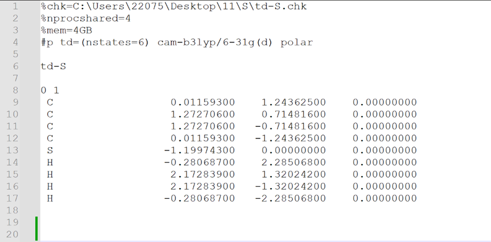

* 选择Energy选项进行计算

* 输入文件编辑完成后，用Gaussian16打开进行计算。

* Gaussian16计算完成后，通过Utilities--FormChk，将.chk文件转换为.fch文件格式。

* .chk文件格式无法通过记事本形式打开，会出现乱码；.fch文件格式可以通过记事本形式打开##

### Gaussian16：

* 打开.out文件，在Results选项中选择UV-Vis选项，即可得到该分子体系的紫外-可见光光谱，如下所示：

* 上图为紫外-可见光光谱；下图为电子圆二色性谱

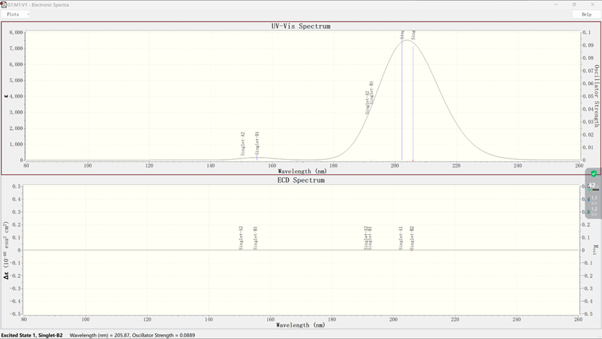

* 点击鼠标右键，选择Save Data，即可将分子光谱数据保存为文本格式，后续可采用Origin软件进行绘图编辑，保存数据格式如下：

* .out文件：

* 对.out文件进行分析，我们可以得到很有有用的信息。

* 关于分子体系激发态的一些信息如下图所示：

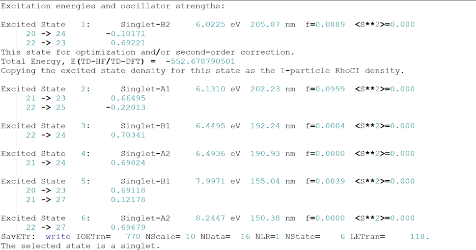

